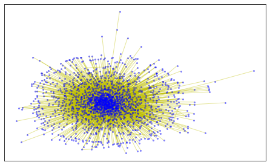

Facebook social network analysis

### Result

visulize the social network in Facebook. In the network, each node corresponds to a user of the website and link weights describe the total number of messages exchanged between users. 

The 1-CDF distributions of node degree k, node strength s and link weight w using loglog-scale are visualized as the above figure

The scatter and bin-averaged plots are shown as following:

