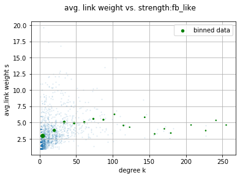

Facebook social network analysis

### Result

visulize the social network in Facebook as following. In the network, each node corresponds to a user of the website and link weights describe the total number of messages exchanged between users.

 
The 1-CDF distributions of node degree k, node strength s and link weight w using loglog-scale are visualized as following

The scatter and bin-averaged plots are shown as following:

 

According to the Granovetter hypothesis, link neighborhood overlap is an increasing function of link weight in social networks. Based on the scatter plot, we can see that link neighborhood overlap is an increasing function of link weight, so the trend is almost accordance with the Granovetter hypothesis, which means that users tend to form social ties to others like them, a person's friends tend to be friends , the network is highly homogeneous. 

